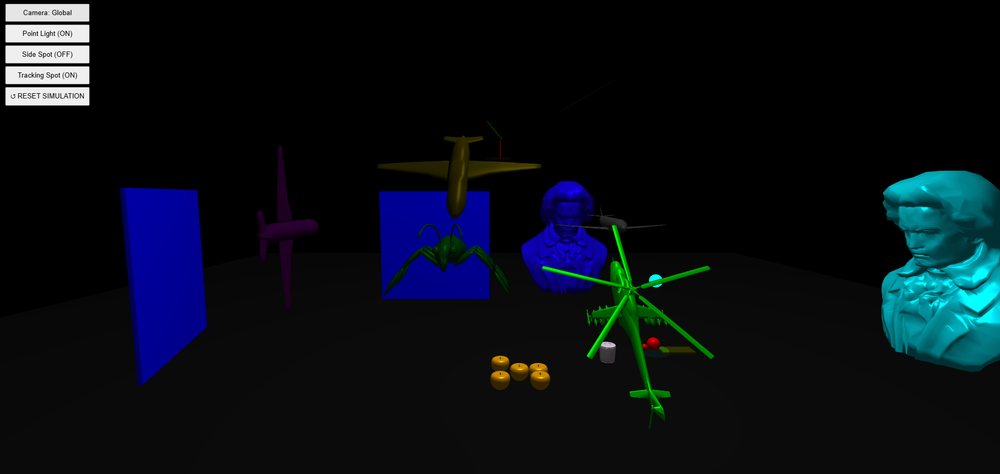

# Assignment 4

A Three.js-based application demonstrating a scene graph implementation with physics-based animations and interactive 3D graphics.

## Screenshot



## About

This assignment implements a physics simulation using Three.js and a custom scene graph system. The scene features:

- **Scene Graph Architecture**: A hierarchical node-based system (`SGNode`) for managing 3D object transformations and animations
- **Physics Simulation**: Ball physics with gravity, ramp rolling, and collision detection
- **Multiple Light Types**: Point lights and spotlights with custom Phong shading
- **Interactive Elements**: Rotating disc mechanism, swinging bars, walls, and a domino that can be knocked over

## How to Run

1. Open terminal and navigate to the project directory.

2. Start a local server. You can use one of the following methods:

   **Using Python:**

   - For Python 3.x:

     ```bash
     python -m http.server
     ```

   - For Python 2.x:

     ```bash
     python -m SimpleHTTPServer
     ```

   **Using VS Code:**

   - Install the "Live Server" extension
   - Right-click on `index.html` and select "Open with Live Server"

   **Using Node.js:**

   ```bash
   npx serve
   ```

3. Open your web browser and go to `http://localhost:8000` (or the port number shown in your terminal).

4. You should see the WebGL application running.

## Controls

### Camera Controls

- **Mouse Drag**: Rotate the camera around the scene
- **Scroll**: Zoom in/out
- **Camera Mode Button**: Toggle between global view and following the ball

### Light Controls

- **Toggle Point Light**: Enable/disable the global white point light
- **Toggle Side Spot**: Enable/disable the red spotlight from the side
- **Toggle Tracking Spot**: Enable/disable the cyan spotlight that follows the ball

### Simulation

- **Reset Simulation**: Restart the physics simulation from the beginning

## Project Structure

```
A4/
├── readme.md         # This file
├── ss.png            # Screenshot (add your screenshot here)
└── src/
    ├── index.html    # Entry point HTML file
    ├── index.js      # Main application logic and physics
    ├── SceneGraph.js # Scene graph node implementation
    └── shaders.js    # GLSL vertex and fragment shaders
```

## Technical Details

- **Scene Graph**: Custom `SGNode` class for hierarchical transformations
- **Lighting**: Custom Phong shader supporting point lights and spotlights with configurable parameters
- **Physics**: Includes gravity, ramp sliding, ball-ball collisions, ball-wall collisions, and ball-bar collisions
- **Animation**: Real-time physics updates with fixed timestep for consistent behavior
