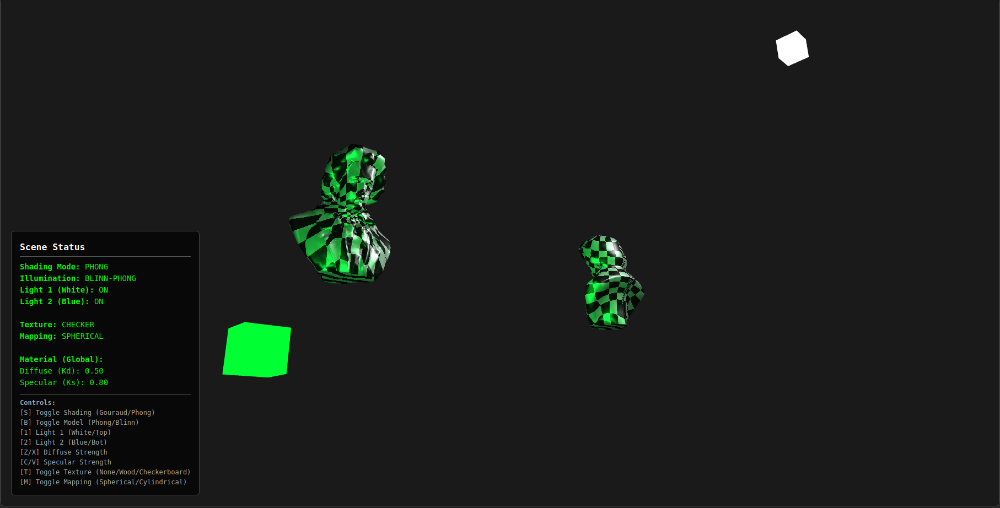

# CG Project

A Computer Graphics project repository containing WebGL-based assignments.

## Assignments

### Assignment 3 (A3)

A WebGL application demonstrating 3D object rendering with various shading techniques including Gouraud and Phong shading, along with Blinn-Phong lighting model.

**Features:**
- Load and display PLY 3D model files
- Toggle between Gouraud (Vertex) and Phong (Pixel) shading
- Toggle between Standard Phong and Blinn-Phong lighting models
- Multiple light sources with individual toggle controls
- Adjustable diffuse and specular lighting strengths
- Interactive camera controls (rotation and zoom)

**Screenshot:**

For more details and instructions, see the [A3 README](A3/readme.md).

### Assignment 4 (A4)

*Coming soon*